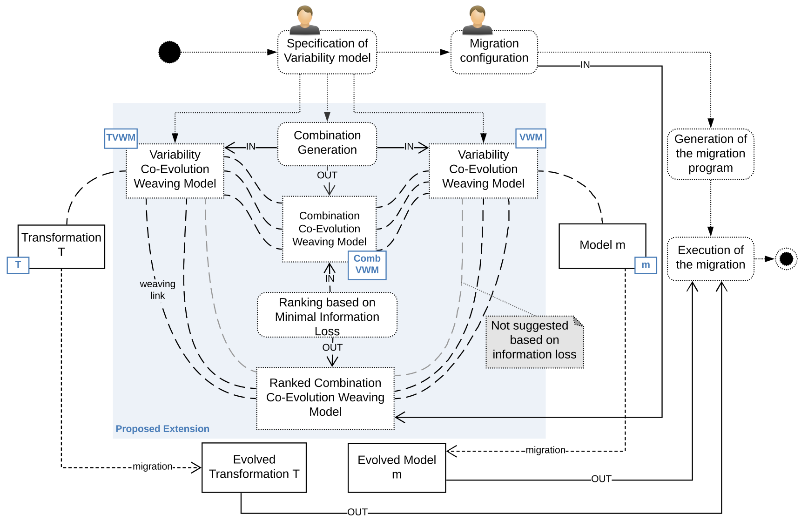

# variabilityCo-evoIL
Model-Driven Engineering (MDE) helps tame the sheer complexity of modern software systems by leveraging abstraction and automation.
Metamodels are at the core of any model-driven projects and give the experts a linguistic means to abstractly represent the problem domain’s instances.

Metamodels allow modelers to define a complete modeling environment that comprehends not only models, but also editors, transformations, analyzers, code generators, and more. 

Metamodels are prone to modifications due to new insights emerging from the domain, improvements, and features being added to the modeling language over time. 

Metamodel evolution may induce severe repercussions over the related artifacts whose validity restoration requires specialized support, so called co-evolution. 

The co-evolution problem poses another issue related to the epistemic uncertainty arising as a response to a metamodel change where many different consistency restoration procedures are possible, e.g., restoring models and transformations. In this work we rely on the notion of information loss(IL) to understand which migration combinations are preferable to others in coupled evolution, by offering a ranking of the possible solutions. 

The IL denotes that part of the knowledge contained in the source models cannot be conveyed or translated into the target models,using a selected transformation, resulting in a loss of information. Such aspect represents an extra-functional quality that can be used for ranking the selection of certain transformation migrations in the context of multiple available alternatives and in combination with model migrations. Information loss induced by a (migrated) transformation can be defined as the amount of information lost executing the (migrated) transformation compared to the original output model obtained by executing the original transformation. 

The proposed approach is supported by a prototype tool that we demonstrate and validate.

---
## Proposed Approach

---
## What the repository contains
This repository contains all the artifacts needed to evaluate the process presented in the paper. 
Specifically, the evaluation has been done by considering the model CompanyModel.xmi and the transformation Company2CRM.  
The refactorings R1–R7  described in the  paper have been singularly applied on the Company metamodel, and all the possible migration alternatives of CompanyModel.xmi and Company2CRM are automatically generated.

In particular:
- in the ***m*** folder, we have all the models used for the evaluation with all the alternatives of CompanyModel.xmi.
- in the ***mm*** folder for each refactoring,we have the related Company.ecore metamodel.
- in the ***t*** folder for each refactoring, we have all the Company2CRM transformation alternatives.

